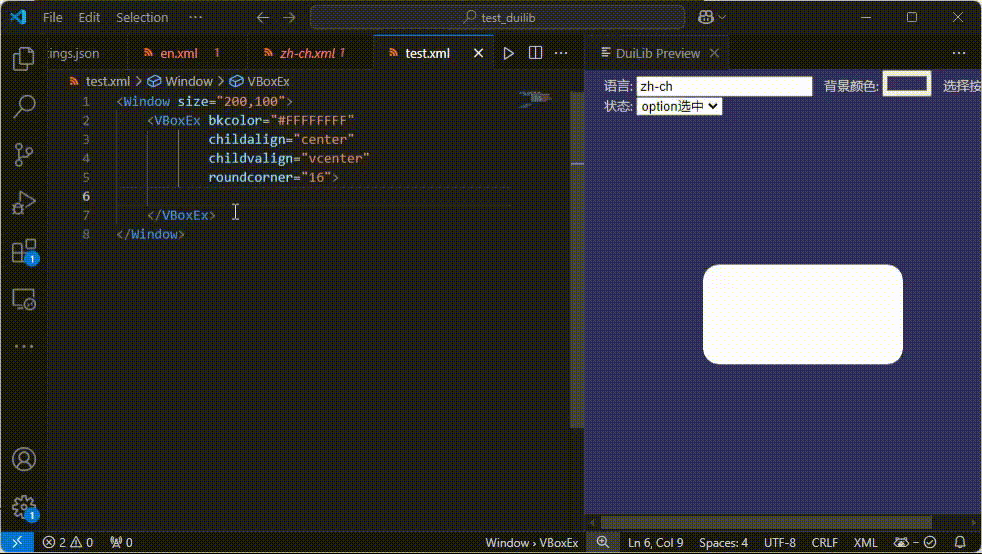
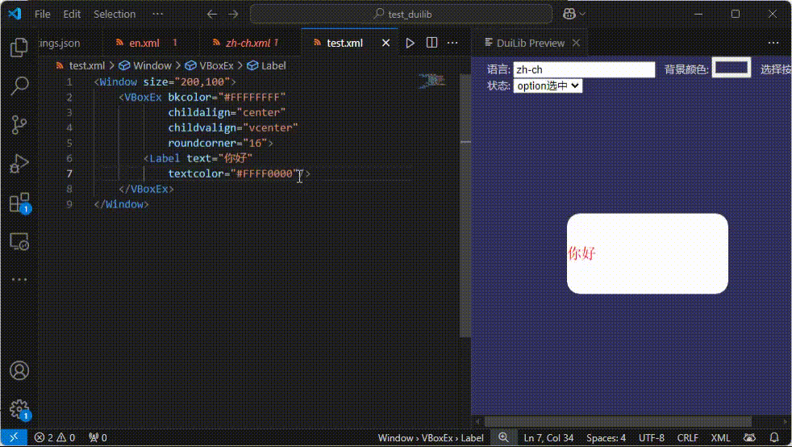

# 本插件能够在VSCode上预览DuiLib的XML文件，这样用VSCode编写UI就很方便了

## 本插件使用的DuiLib版本基于DuiLib开源项目https://github.com/qdtroy/DuiLib_Ultimate

## 使用方法
- 用VSCode打开DuiLib XML文件所在的根目录
- 在XML文件上点击右键，选择DuiLib Preview即可

## 核心功能
- 预览XML文件
- 
- 修改XML文件实时生效
- 
- 多语言预览(请将多语言xml放到language目录下)
- 
- 可预览按钮的不同状态
## TODO
- 预览高DPI
- 窗口阴影
## 感谢
- DuiLib_Ultimate开源项目https://github.com/qdtroy/DuiLib_Ultimate
- https://github.com/hemengke1997 感谢大佬指导VSCode插件编写
